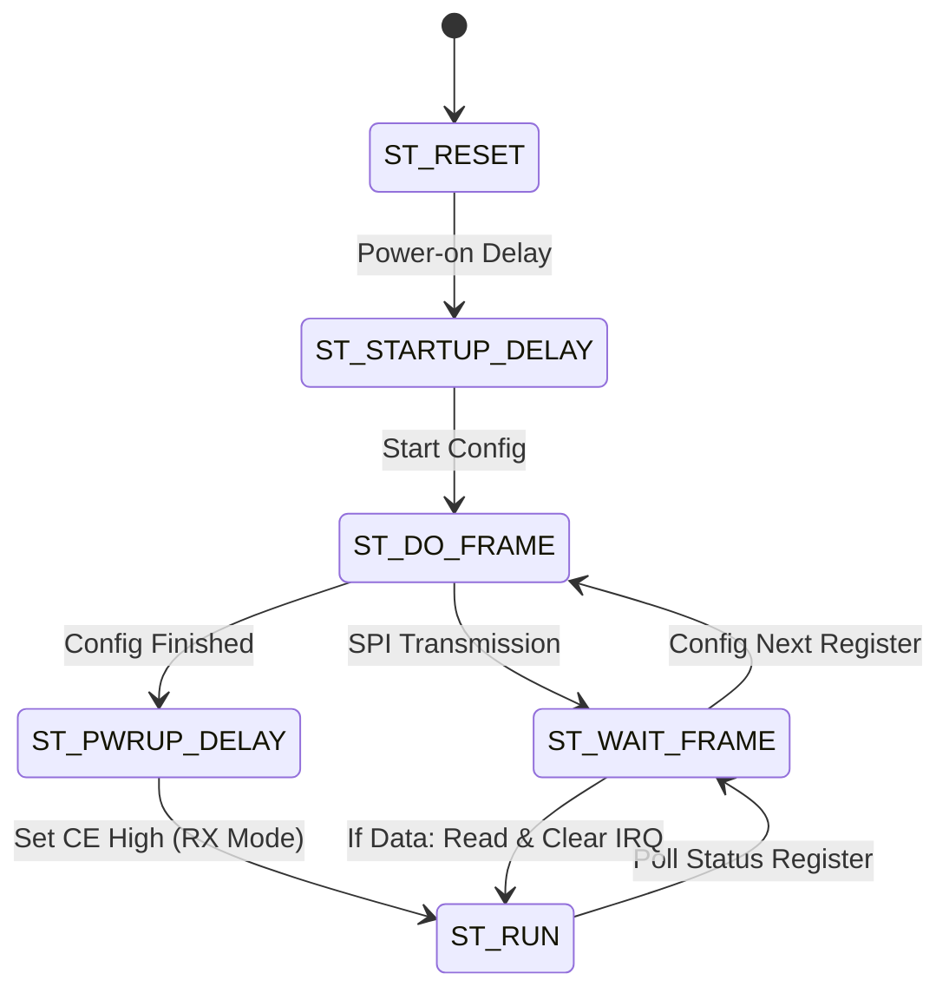

# Hand Gesture-Controlled Vehicle (Arty Z7 & Arduino)

## 📖 Project Overview
This project implements a gesture-controlled robotic car using a **Master-Slave wireless architecture**. 

- **The Master (Transmitter):** An Arduino controller that reads tilt data from an **ADXL335** accelerometer. It processes these gestures into movement commands and transmits them via an **nRF24L01+** radio module.
- **The Slave (Receiver):** An **Arty Z7-20 FPGA** board. It implements a hardware-level SPI Master and a Finite State Machine (FSM) in Verilog to communicate with the nRF24L01+ receiver. The decoded commands drive a DC motor chassis through an **L298N** Dual H-Bridge controller.

---

## 🧩 Hardware Components
### Master Controller:
* **Arduino Uno/Nano**
* **ADXL335** 3-Axis Accelerometer
* **nRF24L01+** Wireless Transceiver
* 10µF Capacitor (Recommended for nRF24L01+ power stability)

### Slave (Car):
* **Arty Z7-20** FPGA Board
* **nRF24L01+** Wireless Transceiver
* **L298N** Motor Driver Module
* 2x/4x DC Motors + Chassis
* External Battery (7.4V - 12V Li-ion recommended for motors)

---

## 📂 Repository Structure
```text
├── docs/                   # Documentation 
├── firmware_master/        # Arduino source code
│   └── src/
│       └── transmitter.ino # Gesture logic and TX code
├── hardware_slave/         # FPGA Verilog source files
│   ├── constrs/
│   │   └── Arty-Z7-20-Master.xdc  # Pin constraints
│   └── src/
│       ├── Receiver_Top.v         # Top module & nRF24 FSM
│       └── Motor_Controller.v     # PWM & Motor logic
└── README.md
```

---

## 🔌 Hardware Wiring Guide

### 1. Master: Arduino Connections
| nRF24L01+ Pin | Arduino Pin | ADXL335 Pin | Arduino Pin |
| :--- | :--- | :--- | :--- |
| **VCC** | **3.3V ONLY** | **VCC** | 3.3V or 5V |
| **GND** | GND | **GND** | GND |
| **CE** | D8 | **X-Axis** | Analog A0 |
| **CSN** | D10 | **Y-Axis** | Analog A1 |
| **SCK** | D13 | | |
| **MOSI** | D11 | | |
| **MISO** | D12 | | |

### 2. Slave: Arty Z7-20 Connections
Connections are made via Pmod headers. Ensure the wiring matches the physical pins defined in `Arty-Z7-20-Master.xdc`.

**Pmod JA (Wireless Receiver)**
| nRF24L01+ Pin | Pmod JA Pin | FPGA Pin |
| :--- | :--- | :--- |
| MOSI | Pin 1 | Y18 |
| SCK | Pin 2 | Y19 |
| MISO | Pin 3 | Y16 |
| CE | Pin 4 | Y17 |
| CSN | Pin 7 | U18 |

**Pmod JB (Motor Driver)**
| L298N Pin | Pmod JB Pin | FPGA Pin |
| :--- | :--- | :--- |
| ENA (PWM A) | Pin 1 | Y14 |
| IN1 | Pin 2 | T11 |
| IN2 | Pin 3 | T10 |
| ENB (PWM B) | Pin 7 | V16 |
| IN3 | Pin 8 | W16 |
| IN4 | Pin 9 | V12 |

---

## 💻 Software Setup

### Master (Arduino IDE)
1. Install the **RF24 library** by TMRh20 via the Library Manager (`Ctrl+Shift+I`).
2. Open `firmware_master/src/transmitter.ino`.
3. Select your board and port, then click **Upload**.
   - *Note:* The code is set to Channel `76`, `1MBPS` speed, and `Auto-Ack` is disabled for low latency.

### Slave (Xilinx Vivado)
1. Open Vivado and create a new **RTL Project** for the **Arty Z7-20**.
2. Add all Verilog files from `hardware_slave/src/` as **Design Sources**.
3. Add `hardware_slave/constrs/Arty-Z7-20-Master.xdc` as a **Constraints File**.
4. In the Project Manager, ensure `Receiver_Top.v` is set as the **Top Module**.
5. Run **Run Synthesis**, **Run Implementation** and **Generate Bitstream** and program the FPGA.

*Note: If you do not see the Arty Z7-20 board in the selection list, you must install the **Digilent Vivado Board Files**. Follow the official instructions on the [Digilent Vivado Boards GitHub repository](https://github.com/Digilent/vivado-boards).*

---

## ⚙️ Logic & Communication Protocol

### Data Format (Payload[0])
The command is sent as a 4-bit nibble within the first byte of the payload:
* **Bits [3:2] (Speed):** `00`=Stop, `01`=Normal, `10`=Turbo, `11`=Reverse.
* **Bits [1:0] (Steer):** `00`=Straight, `10`=Left, `01`=Right.

### Finite State Machine (FSM) Logic
The receiver uses an FSM to manage the complex initialization and polling sequence of the nRF24L01+ without a CPU:



---

## 🎮 Gesture Controls
* **Forward Tilt:** Move forward. Continued tilting increases speed (Turbo).
* **Backward Tilt:** Slow down or move in reverse.
* **Left/Right Tilt:** Car turns by adjusting the PWM duty cycle of left/right motor pairs.